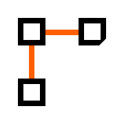
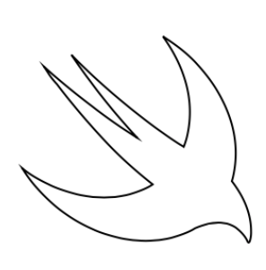

# PathBuilder

_Path builder_ is a complete result builder for lifting `Path` into the declarative SwiftUI world. This `@resultBuilder` can be used for elegant and short definition of paths. Missing documentation gaps in SwiftUI are filled in using the old but good CGMutablePath knowledge.

## Motivation

I just wanted to learn to implement result builders. And during playing with animated paths in SwiftUI found a perfect place to experiment.

## Usage

### Examples

With _PathBuilder_ you can write this to draw a triangle:

```swift
Path {
    Move(to: CGPoint(x: 50, y: 50))
    Line(to: CGPoint(x: 100, y: 100))
    Line(to: CGPoint(x: 0, y: 100))
    Close()
}
```

Instead of longer version:

```swift
Path { p in
    p.move(to: CGPoint(x: 50, y: 50))
    p.addLine(to: CGPoint(x: 100, y: 100))
    p.addLine(to: CGPoint(x: 0, y: 100))
    p.closeSubpath()
}
```

Drawing a Swift logo can be implemented like [this](Documentation/SwiftLogo.swift).



### Path components

There are many basic path components present. You can create a new one by conforming to the `PathComponent` protocol.

#### Elementary components

- *Arc* – Adds an arc of a circle to the path, specified with a radius and angles.
- *Close* – Closes and completes a subpath in a path.
- *Curve* – Adds a cubic Bézier curve to the path, with the specified end point and control points.
- *Oval* – Adds an ellipse that fits inside the specified rectangle.
- *EmptySubpath* – Adds empty subpath, used mainly as a temporary placeholder.
- *Line* – Appends a straight line segment from the current point to the specified point.
- *Lines* – Adds a sequence of connected straight-line segments to the path.
- *Move* – Begins a new subpath at the specified point.
- *QuadCurve* – Adds a quadratic Bézier curve to the path, with the specified end point and control point.
- *Rect* – Adds a set of rectangular subpaths to the path.
- *RelativeArc* – Adds an arc of a circle to the path, specified with a radius and a difference in angle.
- *RoundedRect* – Adds a subpath to the path, in the shape of a rectangle with rounded corners.
- *TangentArc* – Adds an arc of a circle to the path, specified with a radius and two tangent lines.

#### Grouping components

- *Loop* – Appends components to path iterating over supplied sequence and building path for each element.
- *Subpath* – Groups and appends another subpath object to the path and optionally transforms it.

## Requirements

For Swift 5.1 to 5.3 use package version 1.1.1.

Otherwise for version 2.0+ use latest tools:

- Xcode 12.5 or above
- Swift 5.4 or above
- iOS 13, macOS 10.15, watchOS 6.0, tvOS 13.0 or above

## Installation

Using Swift Package Manager in Xcode
or by adding to your Package manifest file.

## Contributing

All contributions are welcome.

Project was created by [Matěj Kašpar Jirásek](https://github.com/mkj-is).

Project is licensed under [MIT license](LICENSE.txt).
